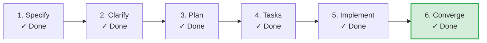

# SDLC Lifecycle: Card Advance Guard

**Track**: Feature | **Current Phase**: `CONVERGED` | **Status**: `CONVERGED`  
**Created**: 2026-09-03 19:32 UTC | **Last Updated**: 2026-09-03 19:38 UTC

**Task Progress**: 100% (34/34 tasks completed)

> [!TIP]
> **Next Recommended Action**: `Complete`  
> *Feature lifecycle converged and verified*

## Milestone Timeline

| Phase | Command / Source | Status | Started | Completed | Duration | Notes |
|---|---|---|---|---|---|---|
| **Specify** | `/speckit-specify` | `COMPLETED` | 19:32:07 | 19:33:07 | 1m 0s | Feature specification verified from spec.md |
| **Checklists** | `/speckit-checklist` | `COMPLETED` | 19:33:08 | 19:34:07 | 59s | Quality checklists verified from checklists/ |
| **Plan** | `/speckit-plan` | `COMPLETED` | 19:34:08 | 19:35:07 | 59s | Implementation plan verified from plan.md |
| **Tasks** | `/speckit-tasks` | `COMPLETED` | 19:35:08 | 19:36:07 | 59s | Dependency-ordered tasks breakdown verified from tasks.md |
| **Implement** | `/speckit-implement` | `COMPLETED` | 19:36:08 | 19:37:07 | 59s | Implementation progress reconciled from tasks.md |
| **Converge** | `/speckit-converge` | `COMPLETED` | 19:37:08 | 19:38:07 | 59s | Convergence verified and completed |
