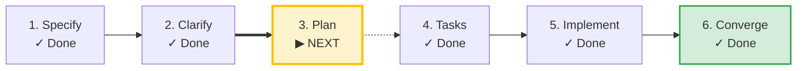

# SDLC Lifecycle: [FEATURE NAME]

**Track**: Feature | **Current Phase**: `CONVERGED` | **Status**: `CONVERGED`  
**Created**: 2026-09-04 15:01 UTC | **Last Updated**: 2026-09-04 18:29 UTC

**Task Progress**: 92% (35/38 tasks completed)

> [!WARNING]
> **Soft Drift Advisory**: spec.md was modified after plan.md was generated. Review plan or run /speckit-plan.

> [!TIP]
> **Next Recommended Action**: `/speckit-plan`  
> *Review and update implementation plan*

## Milestone Timeline

| Phase | Command / Source | Status | Started | Completed | Duration | Notes |
|---|---|---|---|---|---|---|
| **Specify** | `/speckit-specify` | `COMPLETED` | 15:01:02 | 15:02:02 | 1m 0s | Feature specification verified from spec.md |
| **Specify** | `/speckit-specify` | `COMPLETED` | 15:02:08 | 15:04:07 | 1m 59s | Specify milestone completed |
| **Plan** | `/speckit-plan` | `COMPLETED` | 15:17:50 | 15:25:09 | 7m 19s | Plan milestone completed |
| **Tasks** | `/speckit-tasks` | `COMPLETED` | 16:12:43 | 16:16:04 | 3m 21s | Tasks milestone completed |
| **Analyze** | `/speckit-analyze` | `COMPLETED` | 16:35:53 | 16:38:16 | 2m 23s | Analyze milestone completed |
| **Implement** | `/speckit-implement` | `INTERRUPTED` | 17:46:55 | 18:26:30 | 39m 35s | Command started (interrupted before completion) |
| **Analyze** | `/speckit-analyze` | `COMPLETED` | 18:26:30 | 18:27:58 | 1m 28s | Analyze milestone completed |
| **Converge** | `/speckit-converge` | `COMPLETED` | 18:28:59 | 18:29:31 | 32s | Converge milestone completed |
